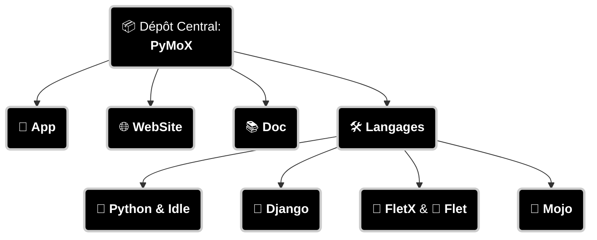

# PyMoX
Dépôt Officiel du concept PyMoX

# 🧭 Projet Central – Portail des Dépôts

Bienvenue dans le dépôt central de l'écosystème **PyMoX**-fr, pour des études et projets liés aux langages tels que Python, Django, Flet, FletX, et Mojo (Liste non exhaustive...).

Ce dépôt central regroupe les dépôts indépendants liés à ces sujets, ainsi que ce projet lui-même, entièrement open-source (sous licence MIT), composé principalement de son application mobile, de son site web et d’une documentation collaborative.

Ce dépôt sert de point d’entrée pour explorer les différents modules, outils, et développemnts dans ces domaines. Il agit comme un hub de navigation pour l’ensemble des composants du projet PyMoX.

## 📦 Dépôts liés

Cette structure traduit aussi la structure des dossiers de ce dépôt central.

## 🔍 Objectifs

- Centraliser les ressources
- Faciliter la navigation entre les projets
- Offrir une vue d’ensemble cohérente

---

## 🤝 Contributions

Chaque dépôt est ouvert aux suggestions, améliorations et retours. N’hésite pas à ouvrir une issue ou proposer une pull request dans le dépôt concerné.

---

## 📬 Contact

📬 Pour toute question ou discussion, rejoignez-nous sur [Discord – PyMoX](https://discord.com/channels/1395436334507626566/1395436335103213571)
